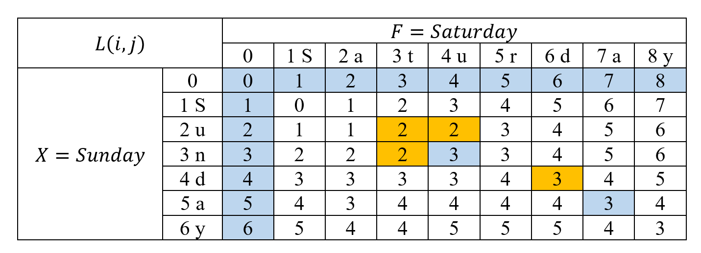

# Edit Distance

## Đề bài

Cho hai xâu X, F
- Xâu X có m ký tự X1, X2, ..., Xm.
- Xâu F có n ký tự F1, F2, ..., Fn

Có 3 phép biến đổi:
- Chèn một ký tự (letter insertion) vào sau ký tự thứ i.
- Thay thế ký tự (letter substitution) ở vị trí thứ i bằng ký tự c
- Xóa ký tự (letter deletion) ở vị trí thứ i

Hãy tìm số lượng ít nhất các phép biến đổi để biến xâu X thành xâu F

## Ví dụ
```
Input: str1 = "geek", str2 = "gesek"
Output: 1
```
Chúng ta có thể biến đổi chuỗi str1 thành chuỗi str2 bằng cách thêm
    một ký tự 's'

```
Input: str1 = "cat", str2 = "cut"
Output: 1
```
Chúng ta có thể biến đổi chuỗi str1 thành chuỗi str2 bằng cách thay
    thế ký tự 'a' bằng ký tự 'u'

```
Input: str1 = "sunday", str2 = "saturday"
Output: 3
```
Ta nhận thấy ba ký tự cuối và ký tự đầu của hai chuỗi là giống nhau.
Như vậy đơn giản là ta biến đổi chuỗi 'un' thành chuỗi 'atur'. Điều
này có thể thực hiện bằng ba phép biến đổi. Thay thế ký tự 'n' bằng ký
tự 'r', chèn ký tự 't', chèn ký tự 'a'.

## Công thức đệ quy
Cho m là chiều dài xâu X, n là chiều dài xâu F, L(m,n) là số phép biến
đổi tối thiếu để biến đổi xấu X thành xâu F

```
L(m, 0) = m
L(0, n) = n
L(m, n) = L(m-1, n-1) nếu Xm = Fn
L(m, n) = min(L(m-1, n), L(m, n-1), L(m-1, n-1)) + 1 nếu Xm != Fn
```

## Công thức quy hoạch động



## Tham khảo
- https://en.wikipedia.org/wiki/Edit_distance
- https://www.geeksforgeeks.org/edit-distance-dp-5